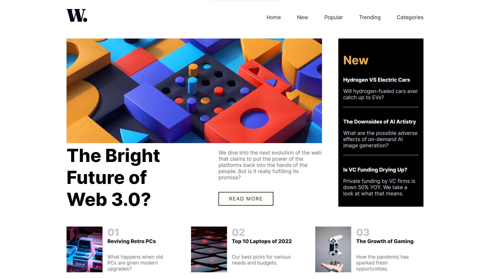

# Frontend Mentor - News homepage solution

This is a solution to the [News homepage challenge on Frontend Mentor](https://www.frontendmentor.io/challenges/news-homepage-H6SWTa1MFl). Frontend Mentor challenges help you improve your coding skills by building realistic projects. 

## Table of contents

  - [The challenge](#the-challenge)
  - [Screenshot](#screenshot)
  - [Links](#links)
  - [Built with](#built-with)
  - [What I learned](#what-i-learned)
  - [Useful resources](#useful-resources)
  - [Acknowledgments](#acknowledgments)

### The challenge

Users should be able to:

- View the optimal layout for the interface depending on their device's screen size
- See hover and focus states for all interactive elements on the page
- **Bonus**: Toggle the mobile menu (requires some JavaScript)

### Screenshot

### Links

- Live Site URL: [Add live site URL here](https://kamilkaluza-news-page.onrender.com)

### Built with

- Semantic HTML5 markup
- CSS custom properties
- Flexbox
- CSS Grid
- Mobile-first workflow
- Vanilla JS 

### What I learned

I can only use existing containers to manipulate DOM via JS.
When I try get element that i create earlier via JS console return 'none'

### Useful resources

- [Example resource 1](https://developer.mozilla.org/en-US/docs/Web/CSS/background-color) - This helped me set obscured site when i press hamburger menu 

## Acknowledgments

Thank you mom.
